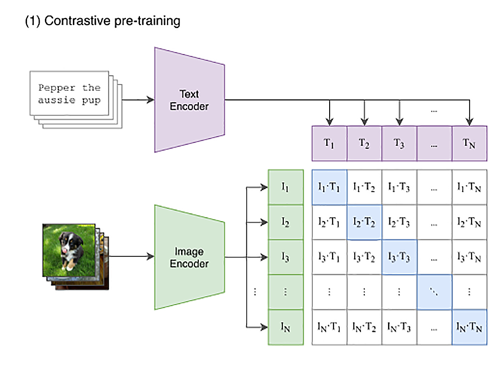

# 多模态的 CLIP 模型
所谓“多模态”，就是多种媒体形式的内容。 CLIP 这个模型，就是一个多模态模型。
一如即往，OpenAI 仍然是通过海量数据来训练一个大模型。
整个模型使用了互联网上的 4 亿张图片，它不仅能够分别理解图片和文本，还通过对比学习建立了图片和文本之间的关。

CLIP 的思路其实不复杂，就是利用互联网上已有的大量公开的图片数据。
而且其中有很多已经通过 HTML 标签里面的 title 或者 alt 字段，提供了对图片的文本描述。
```


```
我们只要训练一个模型，将文本转换成一个向量，也将图片转换成一个向量。



图片向量应该和自己的文本描述向量的距离尽量近，和其他的文本向量要尽量远。
那么这个模型，就能够把图片和文本映射到同一个空间里。我们就能够通过向量同时理解图片和文本了。

demo1: dog-or-cat.py


## 理论补充
### openai/clip-vit-base-patch32
"openai/clip-vit-base-patch32"是一个基于Vision Transformer（ViT）模型预训练的CLIP模型。

这个模型使用了ViT架构，ViT是一种基于Transformer的图像编码器，它通过自注意力机制来捕捉图像中的上下文信息。
此外，该模型还使用了32x32的图像补丁作为输入，这有助于捕捉更多的图像细节。

相较于传统的CNN架构，ViT具有更强的捕捉图像上下文信息的能力，这使得它在处理图像分类、目标检测、图像生成等任务时具有更好的性能。

除了"openai/clip-vit-base-patch32"之外，OpenAI还提供了其他不同规模和架构的CLIP模型，
例如"openai/clip-vit-large-patch32"、"openai/clip-bert-base-uncased"等。

如果需要处理更复杂的图像和文本匹配任务，特别是需要捕捉图像中的更多上下文信息，"openai/clip-vit-large-patch32"可能是一个更好的选择。
而如果需要在图像和文本匹配任务中更好地处理文本信息，"openai/clip-bert-base-uncased"可能更为适合。