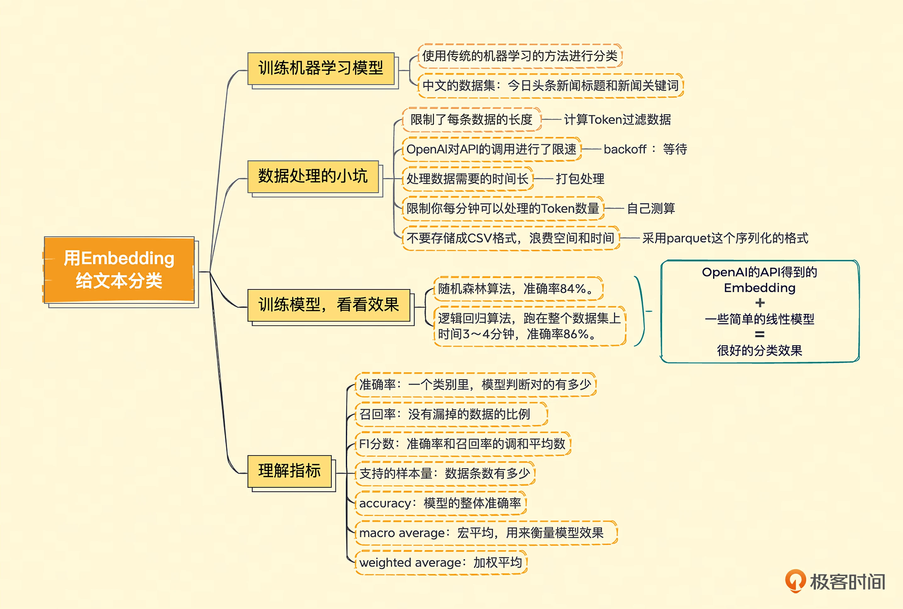

# explanation for demos

## b.classifier_with_embedding.py
In this text classification task, we predict the score of a food review (1 to 5) based on the embedding of the review's text. 

我们把 5 个不同的分数分成了正面、负面和中性，还去掉了相对难以判断的“中性”评价，这样我们判断的准确率高的确是比较好实现的。
但如果我们想要准确地预测出具体的分数呢？

最简单的办法就是利用我们拿到的文本 Embedding 的向量。
这一次，我们不直接用向量之间的距离，而是使用<strong>传统的机器学习的方法随机森林</strong>来进行分类。
毕竟，如果只是用向量之间的距离作为衡量标准，就没办法最大化地利用已经标注好的分数信息了。

数据集通过 a.get_dataset_embeddings 获取

reference: https://github.com/openai/openai-cookbook/blob/main/examples/Classification_using_embeddings.ipynb

Embedding 给文本分类:

## c. comment_analysis.py
这个例子中，对于任何一段文本评论，我们都可以通过 API 拿到它的 Embedding。
那么，把这段文本的 Embedding 和“好评”以及“差评”通过余弦距离（Cosine Similarity）计算出它的相似度。
然后拿这个 Embedding 和“好评”之间的相似度，去减去和“差评”之间的相似度，就会得到一个分数。

如果这个分数大于 0，那么说明我们的评论和“好评”的距离更近，我们就可以判断它为好评。
如果这个分数小于 0，那么就是离差评更近，我们就可以判断它为差评。

## d.good_or_bad.py
这个“给一个任务描述、给少数几个例子、给需要解决的问题”这样三个步骤的组合，也是大语言模型里使用提示语的常见套路。
一般我们称之为 Few-Shots Learning（少样本学习），也就是给一个或者少数几个例子，AI 就能够举一反三，回答我们的问题。