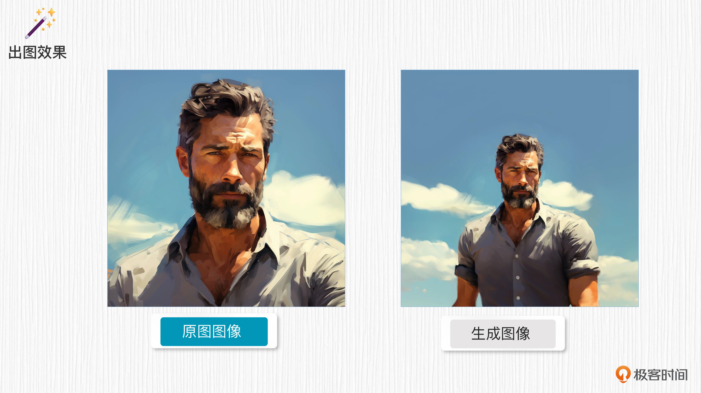

# WebUI

## WebUI的诞生
Stable Diffusion 是这样一个过程：任何一张图像都可以通过不断添加噪声变成一张完全被噪声覆盖的图像；
反过来，任何一张噪声图像通过逐步合理地去除噪声，变得清晰可辨。

Stable Diffusion（以下简称 SD）在 AI 绘画领域中闪耀着耀眼的光芒，
SD 背后的方法在学术界被称为 Latent Diffusion，论文发表于 2022 年计算机顶会 CVPR

复杂的代码逻辑也让普通用户望而却步。我们今天要用到的 WebUI 便应运而生。
2022 年 10 月，开源社区 AUTOMATIC1111 推出了名为 “stable-diffusion-webui” 的图形化界面，
为普通用户提供了方便快捷的构建 SD 模型图像 UI 界面的工具。

通过这个界面，用户可以体验到 SD 模型一系列的功能，包括：<strong>文生图、图生图、inpainting 和 outpainting</strong> 等等，
甚至还能自定义训练具有指定风格的全新模型。

与其他 AI 绘画类模型如 Midjoruney、DALL-E 2 相比，SD WebUI 可以免费在个人电脑或服务器上运行，并根据用户意愿进行改造和扩展。
随着社区力量的涌入，SD WebUI 还拥有了<strong>丰富的插件，如 LoRA、ControlNet</strong> 等，它们让原生 SD 模型的能力和表现更加出色。


## WebUI本地安装
如果你拥有个人显卡或 GPU 服务器，并且希望按照官方的安装方式进行操作，那么首先需要下载 SD WebUI 的代码。
```
git clone https://github.com/AUTOMATIC1111/stable-diffusion-webui.git
```

## 常用参数


- Stable Diffusion checkpoint：这里可以选择已经下载的模型。目前许多平台支持开源的 SD 模型下载，例如 Civitai、Hugging Face 等。
- txt2img：这个选项表示启用文生图（text-to-image）功能。类似地，img2img 等选项则代表其他功能。
- prompt：用于生成图像的文字输入，需要使用英文输入，但你也可以通过探索 Extensions 来实现中文输入。
- negative prompt：这是生成图像的反向提示词，用于指定你不希望模型生成的内容。例如，如果你不想图像中出现红色，可以在这里输入“red”。
- Sampling method：不同的采样算法，这里深入了 Diffusion 算法领域，稍后我们会更详细地讲解。简单来说，通过这些采样算法，噪声图像可以逐渐变得更清晰。
- Sampling steps：与采样算法配合使用，表示生成图像的步数。步数越大，需要等待的时间越长。通常 20-30 步就足够了。
- Width & Height：生成图像的宽度和高度。
- Batch size：每次生成的图像数。如果显存不够大，建议调小这个数值。
- CFG scale：这里表示 prompt 的影响程度。值越大，prompt 的影响就越大。
- Seed：生成图像的随机种子，类似于抽奖的幸运种子，会影响生成的图像结果。


## 模型安装
将模型放置在 WebUI 安装路径下的模型文件夹中：
```
# 模型文件夹地址：./stable-diffusion-webui/models/Stable-diffusion 
model：realisticVisionV13_v13.safetensors[c35782bad8]
prompt：a photo of a cute cat
Sampling method：Euler A
Sampling steps：20
Width & Height: 512
Batch size: 4
CFG scale: 7
seed: 10
```

可以从
```
https://civitai.com/models/4201?modelVersionId=6987
```
下载模型。


# 常用功能

## tex2img（文生图）
在WebUI输入prompt
```
a photo of a cute and happy cat
```
即可生成图片。


## image2image（图生图）
img2img 的原理。首先，输入图像经过添加噪声的处理，变成了一个“不清晰的噪声图”。
然后，通过结合不同的 prompt 语句，图像逐渐变得清晰，并呈现出与 prompt 语句相关的风格。

## Outpainting：延展图像
这个功能可以帮我们扩展图像的边界或填充缺失的区域，使整体图像更完整。
它的基本原理是将原始图像中的图像之外的区域看作“不清晰的噪声图”，但会保持原本区域不变，并参考原始图像的信息来生成原图之外的内容。



## Inpainting：局部重绘
我们可以在图像内部绘制一个遮罩（mask），使用不同的 prompt 语句，就可以为该遮罩重新绘制新的内容。
这样做可以根据所选择的风格和要表达的意图，在图像的特定区域上添加或修改内容，从而实现更具创意和个性化的图像效果。


## 强调 prompt 的关键词
在 WebUI 中，有时我们希望强调 prompt 语句中的特定词汇。为了实现这一目的，我们可以<strong>使用圆括号 ( ) 来突出显示这些词汇</strong>。

举个例子，如果我们想强调少年头发的卷曲特征，即 curly hair，只需在该词汇外添加多个 ( )，以突出显示该词汇，从而引导生成模型更加关注这一特定要素。


## Negative prompt：反向提示词
通过在 negative prompt 区域添加不想出现的信息，比如在此处添加 “smile（微笑）”，就可以去掉笑容。

## Face restoration：面部修复
通过对生成的人脸进行修复，可以改善细节、纠正不准确的特征，让生成的人脸显得更加自然和美观。这种修复过程可以针对人脸区域做精细调整，提升生成结果的真实感和质量。


WebUI 的功能，不光是前面我们提到的这几种。通过探索 WebUI 的 Extensions，你会发现更多让人惊喜的功能和工具，实现更多个性化的需求。
例如，你可以探索中文输入的扩展，方便你在中文模式下生成和编辑图像。

此外，用户也可以通过自定义训练模型，实现更加个性化和定制化的图像生成。通过指定特定的风格和样本图像，用户可以训练出符合自己需求的模型，进一步发挥创造力。