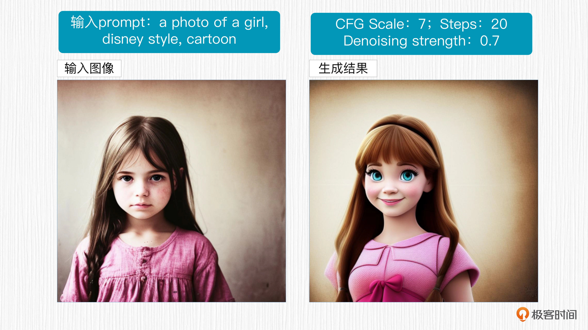

# image2image

## 图生图可以做哪些事情？
- 输入一张真实拍摄的照片，保持图像构图输出一张风格化的绘画结果。
- 输入一张低分辨率的照片，输出一张高分辨率的清晰照片。
- 输入一件衣服，输出一个模特穿着这件衣服。
- 输入一张局部涂抹的照片，输出一张 AI 算法补全后的照片。
- 输入一张图片，输出这种图片向外延展之后的效果等等。

## 通过重绘强度控制图生图效果
选择 img2img 这个标签，prompt 和 negative prompt 的操作与之前相同，在下方 drop image here 区域内，
可以点击选择需要修改的图像，或者拖拽一张新图像进来。

图生成图需要输入 prompt 和原始图像。首先，原始图像会经过加噪处理，转变为 Stable Diffusion 模型可以处理的“噪声图像”。
然后，再根据 prompt 的引导生成图像。

通过观察你可以发现，这种方式生成的图像与原图相似，但风格变成了迪斯尼风格。
同时，一个新变量——即 Denoising strength（重绘强度）出现了。

重绘强度仅在图生成图（img2img）或高清修复过程中被应用，这个变量表示图像加噪的程度。
它代表了生成的图像相对于原始输入图像内容的变化程度: <strong>数值越高，AI 对原图的参考程度就越低，生成的图像和原图的区别就越大</strong>。

较高的重绘强度则可以帮助模型更好地理解并生成与 prompt 相关的内容，同时保留原始图像的整体结构。