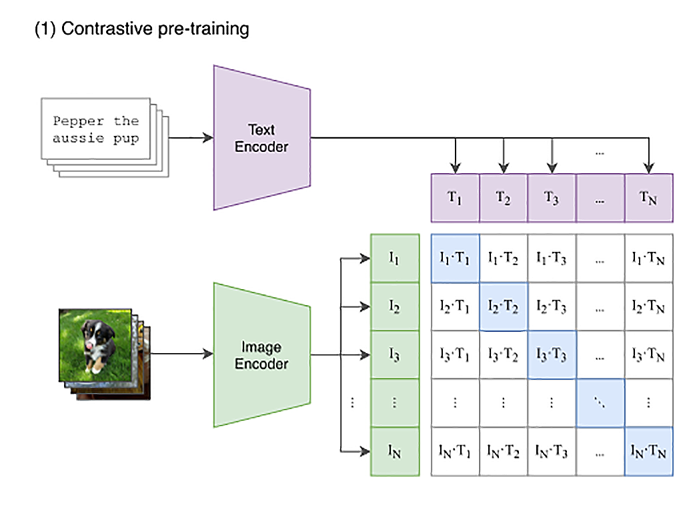

# CLIP
OpenAI 在 2021 年提出 CLIP 算法。在 AI 绘画的过程中，CLIP 的作用是理解我们给到模型的 prompt 指令，将 prompt 指令编码为模型能理解的“语言”。

最早提出 CLIP 模型并不是帮助 AI 绘画模型理解 prompt 指令，而是用于连接图像和文本这两种模态。如今，随着 AIGC 技术的大爆发，CLIP 模型又在 AI 绘画、多模态大模型等方向发挥了巨大价值。

## 追本溯源：CLIP 的提出背景
### 模态
首先要理解模态（Modality）的概念。在深度学习领域，模态可以用于描述输入数据的不同形式，比如图像、文本、音频等。不同的模态可以提供不同的特征，使模型能够从更多的角度理解和处理数据。

我们常说的 NLP（Natural Language Processing），即自然语言处理，解决的就是文本模态的任务，比如文本问答、文本对话、文本情绪分析等任务。

和它并列的是 CV（Computer Vision），即计算机视觉，解决的是图像模态的任务，当然广义上也包括视频、红外图像等信息输入。CV 算法解决的问题包括图像分类、图像目标检测、图像生成等。音频处理算法，比如语音识别、语音合成、声音情感分析等能力解决的便是音频模态的任务。

我们最近常常讨论的 AI 绘画和 ChatGPT，就分别是 CV 领域和 NLP 领域的明星技术。而 GPT-4，则是同时使用了文本模态和图像模态两种输入信息。

CLIP 被提出之前主要有这样两个痛点。
- 第一，CV 数据集标注是个劳动密集型任务，标注成本高昂。
- 第二，每个 CV 模型通常只能胜任一个任务，无法轻易迁移到新的任务。

<br>

## 多模态的 CLIP 模型
所谓“多模态”，就是多种媒体形式的内容。 CLIP 这个模型，就是一个多模态模型。
一如即往，OpenAI 仍然是通过海量数据来训练一个大模型。
整个模型使用了互联网上的 4 亿张图片，它不仅能够分别理解图片和文本，还通过对比学习建立了图片和文本之间的关。

CLIP 的思路其实不复杂，就是利用互联网上已有的大量公开的图片数据。
而且其中有很多已经通过 HTML 标签里面的 title 或者 alt 字段，提供了对图片的文本描述。
```


```
我们只要训练一个模型，将文本转换成一个向量，也将图片转换成一个向量。

CLIP 通过巧妙的设计利用了图像模态和文本模态的对应关系。CLIP 分别构造了一个图像编码器和一个文本编码器，将图像及其文本描述映射到一个特征空间，比如我们可以映射到 512 维度的特征空间。简言之，一张图或者一个文本描述，经过映射都是 512 个浮点数。



图片向量应该和自己的文本描述向量的距离尽量近，和其他的文本向量要尽量远。
那么这个模型，就能够把图片和文本映射到同一个空间里。我们就能够通过向量同时理解图片和文本了。

下面是这个过程的伪代码，可以帮你进一步强化理解:
```
# image_encoder - 图像编码器可以使用ResNet或者Vision Transformer结构
# text_encoder - 文本编码器可以使用CBOW或者Text Transformer结构 
# I[n, h, w, c] - 一个训练批次的图像 
# T[n, l] - 一个训练批次的对应文本图像 
# W_i[d_i, d_e] - 可学习的图像特征投影层权重  
# W_t[d_t, d_e] - 可学习的文本特征投影层权重
# t - 一个可学习的温度系数
 
# 第一步，提取图像和文本模态的表征
I_f = image_encoder(I) #[n, d_i] 
T_f = text_encoder(T) #[n, d_t] 

# 图像表征和文本表征分别映射到共同的多模态空间 [n, d_e] 
I_e = l2_normalize(np.dot(I_f, W_i), axis=1) 
T_e = l2_normalize(np.dot(T_f, W_t), axis=1) 

# 计算余弦相似度 [n, n] 
logits = np.dot(I_e, T_e.T) * np.exp(t) 

# 计算损失值 
labels = np.arange(n) 
loss_i = cross_entropy_loss(logits, labels, axis=0) 
loss_t = cross_entropy_loss(logits, labels, axis=1) 
loss = (loss_i + loss_t)/2
```
可以看到，训练过程分为四步：提取表征、映射和归一化、计算距离和更新模型权重。

demo1: dog-or-cat.py

### openai/clip-vit-base-patch32
"openai/clip-vit-base-patch32"是一个基于Vision Transformer（ViT）模型预训练的CLIP模型。

这个模型使用了ViT架构，ViT是一种基于Transformer的图像编码器，它通过自注意力机制来捕捉图像中的上下文信息。
此外，该模型还使用了32x32的图像补丁作为输入，这有助于捕捉更多的图像细节。

相较于传统的CNN架构，ViT具有更强的捕捉图像上下文信息的能力，这使得它在处理图像分类、目标检测、图像生成等任务时具有更好的性能。

除了"openai/clip-vit-base-patch32"之外，OpenAI还提供了其他不同规模和架构的CLIP模型，
例如"openai/clip-vit-large-patch32"、"openai/clip-bert-base-uncased"等。

如果需要处理更复杂的图像和文本匹配任务，特别是需要捕捉图像中的更多上下文信息，"openai/clip-vit-large-patch32"可能是一个更好的选择。
而如果需要在图像和文本匹配任务中更好地处理文本信息，"openai/clip-bert-base-uncased"可能更为适合。


## CLIP 模型在AI绘画的应用
对于AI 绘画，CLIP 模型便是让 AI 绘画模型听我们话的关键！在 CLIP 的训练过程中，图像表征和文本表征被线性投影到共同的多模态空间，在文本生图的过程中，prompt 信息便可以通过 CLIP 抽取特征，然后指导模型作画。

以 Stable Diffusion 为例，我们已经了解了 Stable Diffusion 模型的 UNet 和 Transformer 结构设计，CLIP 提取得到的文本表征经过交叉注意力（Cross Attention）的方式进行信息注入，便可以将我们的指令传递给模型。

DALL-E 2 模型，它在 CLIP 的基础上进一步扩展，提出 unCLIP 结构，不仅能够用文本指导图像生成，还能输入图像生成多个相似变体