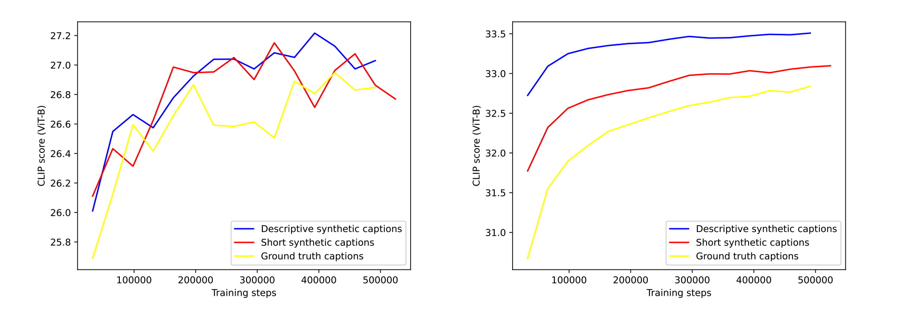

# DALL-E3
在 2023 年 9 月 OpenAI “悄悄”发布了 DALL-E 3 这个 AI 绘画模型。配合 ChatGPT 的 prompt 增强能力，DALL-E 3 模型尤其擅长 Text-in-Image 任务、长文本图像生成任务。熟悉 Midjourney、SDXL 等模型的同学应该更容易感受到 DALL-E 3 带来的能力提升。

ChatGPT 和 NewBing 同样使用 DALL-E 3，生成的效果完全不同。可能原因有两个：
- 第一，NewBing 背后使用的 DALL-E 3 可能是某个“阉割版”，效果不如 ChatGPT 提供的完整版；
- 第二，ChatGPT 会针对我们提供的 prompt，做一个详细扩展，将扩展后的 prompt 提供给 DALL-E 3 生成图像，DALL-E 3 对于经过 ChatGPT 扩展后的 prompt 更友好。

DALL-E 3 有两方面的探索最值得我们关注:
- 一个是如何用生成数据来训练模型;
- 另一个是如何将各种 AI 绘画模型训练技巧有机地组合起来。

总的来说，DALL-E 3 能力的提升主要源自更好的数据策略，同时丢弃掉 DALL-E 2 所采用的 unCLIP 结构，选择在 Stable Diffusion 方案的基础上做出定制化改进。

## 几个基础概念
对于模型训练而言，使用的数据为图文成对数据，其中的文本部分我们称为 caption，也就是图像标题。
从互联网爬取的成对图文数据，其中的 caption 最常用的是 Alt Text（或“alternate text”“alternative text”）。Alt Text 是一个 HTML 属性，它提供了对图片内容的文本描述。
```

```
训练 CLIP 模型使用的就是互联网上的这些图像文本数据，其中的文本部分多数情况下就是图像的 Alt Text。

为什么说多数情况呢？是因为部分图像没有 Alt Text，这时候搜索引擎需要根据网页中图片周围的文本内容，或者由机器学习模型提供的图像分析信息等，为图像生成描述信息。在 DALL-E 3 论文中，基线方案使用的就是 Alt Text 作为训练数据的 caption。

一些图片的caption不是很理想，我们可以使用 BLIP 等模型为图像生成 caption，这个过程称为**图像描述**。

## 数据集重新描述
虽然 Stable Diffusion 模型文生图的效果在不断提升，但是我们在使用 Stable Diffusion 时，还是会经常遇到生成图像很难准确遵循 prompt 内容的情况，也就是模型“不够听话”。

DALL-E 3 的作者认为“不听话”的问题主要是由于训练数据造成的。

在数据维度，DALL-E 3 重新描述了用于训练的图像数据，也就是丢弃掉图片的 Alt Text，用专门的模型生成更准确的 caption。作者将这个技术称为 **Dataset Recaptioning**。

那具体要用什么模型生成图片描述呢？在 DALL-E 3 之前最常用的做法是使用 BLIP、DeepDanbooru 这些模型。用过这些模型的同学会发现，BLIP 生成的 caption 像是一个模子刻出来的，通常就一句话。而 DeepDanbooru 这类模型生成的 prompt 通常是一系列标签，所以使用这类模型时，我们需要使用 “1girl” 这类奇奇怪怪的 prompt。

既然常用的模型不能生成理想的 caption，DALL-E 3 便重新训练了描述生成模型。训练过程分为**预训练和模型微调**两个阶段。


- 图中的图像编码器（Image Encoder）是一个预训练的 CLIP 模型
- 单模态文本解码器（Unimodal Text Decoder）可以提取文本特征，用于和图像特征计算相似度。
- 图像编码器输出的特征会通过交叉注意力机制的形式作用于多模态文本解码器，为图像生成描述。

预训练模型的目的是使用大量数据让模型具备基本的图像理解能力，微调的目的则是通过少部分数据让模型输出信息丰富的 caption.


在模型微调阶段，作者使用两种不同的 caption 语料得到两个描述生成模型，问题的关键还是如何构造高质量的训练语料。

第一个模型使用的语料**仅包含图像主体内容描述**，第二个模型使用的语料则包括**内容翔实的图像内容描述，包括文字信息、颜色细节**等。训练过程和预训练阶段相同，两个微调模型生成的 caption 分别被称为 SSC（短合成语料，short synthetic captions）和 DSC（详细合成语料，descriptive synthetic captions）

虽然论文中没有说明这两份训练语料是如何获得的，我们还是可以大胆猜测，这两份训练语料是由 GPT-4 Vision 模型生成的。

## 生成数据有效性
完成了对图片数据的重新描述，下一步就是验证生成数据的有效性，需要通过实验回答下面两个问题。
- 第一，使用生成数据是否会影响 AI 绘画模型的最终表现。
- 第二，生成数据和真实数据的最佳混合比例是多少。

针对第一个问题，作者设计了三个实验，分别使用真实数据、SSC 数据和 DSC 数据训练文生图任务，分别用 50000 条未参与训练的真实 prompt、DSC prompt 进行文生图测试。

针对测试的 prompt 和生成的图像，用 CLIP 的图像编码器提取图像特征，文本编码器提取文本特征，然后计算它们归一化之后的余弦相似度，用 1 减去余弦相似度便是余弦距离。余弦距离越小，表示图像和文本的一致性越强，也就代表了 AI 绘画模型“更听话”。



左图是使用 50000 真实 caption 数据测试的结果，右图是使用 50000 DSC 数据测试的结果，图像的 y 轴代表的是余弦相似度。可以看出，在实验里，使用 DSC 数据做文生图训练，测试时图文一致性表现更好。

至于为什么没有使用 SSC 数据做测试，作者在论文中的说法是 SSC 数据测试的表现和真实 caption 数据非常接近，所以就没有把结果贴出来。

## 数据混合策略
既然生成数据比真实数据更优质，那我们自然会想到这样一个问题——在训练的时候能否只使用生成数据？答案是不能。

这是因为如果只使用生成数据，模型很容易过拟合到某个我们不知道的范式上，比如首字母大小写、prompt 必须以句号结尾等，这些范式与使用的描述生成模型息息相关。在这种情况下，用户自己写 prompt 进行 AI 绘画的时候，由于不满足训练数据的范式，文生图的效果就会大打折扣。

DALL-E 3 给出了两个有趣的解决思路。

第一个解决思路很简单，既然互联网图片的文本信息多数都是人工撰写的，那就让模型既学习合成数据，也学习真实数据，即使真实数据质量不高。那混合比例怎么确定呢？

论文中设计了多组 DSC 数据和真实数据的混合实验，DSC 数据占比为 65%、80%、90%、95% 等，仍旧使用 CLIP 特征的余弦相似度评估图文一致性。

后面的图片就是实验结果，可以看到，DSC 数据占比 95% 训练得到的模型效果最好。DALL-E 3 的模型便是使用这个数据配比训练得到的。


第二个解决思路是使用 ChatGPT 对用户输入的 prompt 进行“扩写”，论文中称为 “upsample”。后面图片中第一行是原始 prompt 及其文生图效果，第二行是扩写后的 prompt 及其文生图效果。