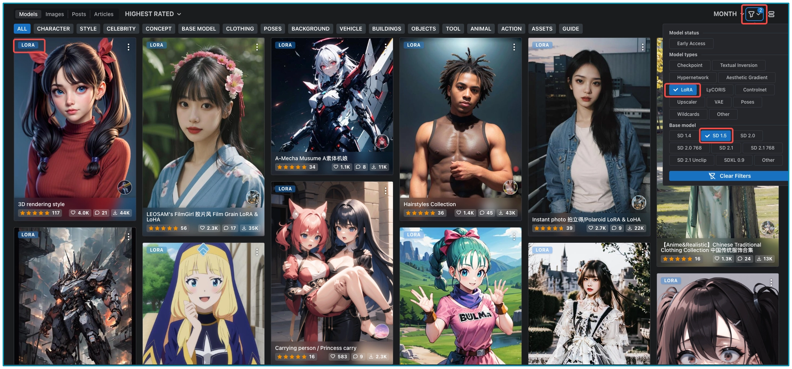
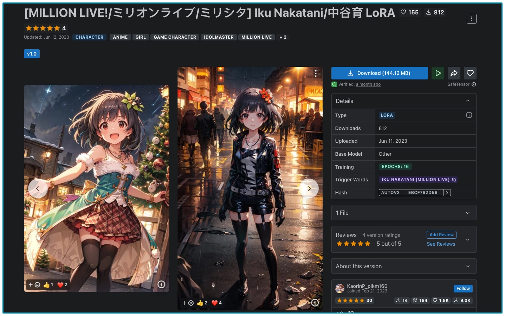

# Lora
引入 LoRA（Low-Rank Adaptation），最初只是想把它当成微调大型语言模型的方法。然而，在 AI 绘画领域，它展现了独特的作用。通俗一点说，我们可以将 LoRA 比喻为一条在广袤大道上的小路，这两条路径都可以达到目的地，但所见的景色却完全不同。

我们先打开 Civitai 网站，找到网站右上角类似漏斗的符号，它能帮我们选择不同功能或设置。当你点击这个漏斗并选择 LoRA 时，网站界面会提示你选择基础模型（Base model）。因为每个 LoRA 要结合基础模型才能使用。选定基础模型后，网站便会呈现所有适合当前基础模型的 LoRA 模型。



当我们遇到一个自己喜欢的 LoRA 模型，需要在 Civitai 的模型信息中找到这个 LoRA 模型对应的基础模型。下载好对应的基础模型，放置在 WebUI 安装位置下面的路径中：stable-diffusion-webui/models/Lora，你便可以获得跟样图十分类似的效果。

现在，假设我们已经获取了一个风格化的 LoRA 模型，例如在 Civitai 开源社区的“大概是盲盒” LoRA 模型。我们将其下载并放入 stable-diffusion-webui/models/Lora 文件夹，可以在 WebUI 中看到。

<br>

## prompt
规范的 LoRA 使用咒语，标准写法是 `<lora: 模型文件名: 权重 >`。通常权重的范围是 0 到 1，其中 0 表示 LoRA 模型完全不起作用。WebUI 会自动加载相应的 LoRA 模型，并根据权重的大小进行应用。

例如：prompt
```
(masterpiece),(best quality),(ultra-detailed), (full body:1.2), 1boy,chibi,cute, smile, flower, outdoors, playing guitar, jacket, blush, shirt
```
negative prompt
```
(low quality:1.3), (worst quality:1.3)
```

<br>

## 角色风格一致性
LoRA 不仅可以作为一个风格化模型，还可以实现对特定 ID 的保持，使得角色在不同的场景和情节中保持一致。这样，读者或观众可以轻易地识别和连接这个角色，并与他建立起情感上的联系，让我们的漫画故事更连贯、更容易被记住。



以上面的模型为例，简称这个 LoRA模型为 IN。IN 是一个经过训练的 LoRA 模型。通过使用 IN 这个 LoRA模型，我们可以确保角色的 ID 在故事中保持不变。

prompt:
```
a photo of a girl, <lora:Iku_Nakatani-000016_v1.0:1>
```
negative prompt:
```
EasyNegative, (worst quality, low quality:1.4), (lip, nose, rouge, lipstick:1.4), (jpeg artifacts:1.4), (1boy, abs, muscular:1.0), greyscale, monochrome, dusty sunbeams, trembling, motion lines, motion blur, emphasis lines, text, title, logo, signature 
```
生成漫画故事主人公。这里的基础模型我们使用 AnythingV5，采样器选择 DPM++ 2s a Karras，采样步数 20 步，初始分辨率设置为 448 x 640，记得开 2 倍超分。
（使用低分辨率+两倍超分这种方式，主要有两个考量：第一，SD1.x系列模型训练的分辨率512x512，直接生成1024x1024效果会有折损（SDXL系列模型分辨率直接是1024x1024）；第二，生成低分辨率看效果，效果不好可以调prompt和超参数，这个过程比较敏捷，毕竟超分功能比较耗时。总的来说，如果你手中的基础模型训练的分辨率是512x512，那么建议先生成这个分辨率的再进行超分。使用SDXL、DeepFloyd IF这类模型，默认分辨率很高，通常就不用考虑超分了。）

每个生成的图像都拥有相同的脸，这个小女孩将成为我们接下来漫画故事的核心角色。在实际操作中，我们可以引入多个不同的 LoRA 模型同时使用。通过结合不同的 LoRA 模型，我们可以混合并匹配不同的风格、特点和创作元素，创造出独特而个性化的作品。这种创作方法不仅丰富了图像的表现力，还让我们能够更好地实现自己的创意和想象。