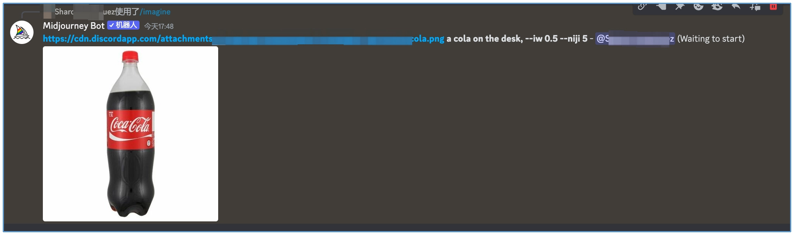

## Midjourney：风头无两的画师
Midjourney 也是 AI 绘画的一大杀器。不同于 WebUI，我们可以在聊天应用程序 Discord 中使用 Midjourney，不需要本地 GPU 资源，也不需要安装任务 WebUI 类的工具。

从 22 年 11 月的 Midjourney v4、Nijijourney，到今年 3 月的 Midjourney v5，MJ 凭借其高质量的生成效果、30 美元一个月的付费服务，实现了非常可观的收入。因此，训练出对标 Midjourney 的模型也成为了很多大企业追求的目标。

相比Stable Diffusion，Midjourney 模型 AI 绘画的效果在精致度、图像文本关联性上都有更显著的优势,但是Midjourney收费。

1. 首先是文字生图，在 Midjourney 的 Discord 论坛中，使用 /imagine 可以触发文生图功能。

Midjourney 描述词 1，创作一幅温馨真挚微笑的年轻亚洲女孩的写实肖像画。
```
Create a realistic portrait of a young asian girl with a warm, genuine smile --ar 2:3 
```
描述词 2，我们要求图像里避免出现眼镜和卷发，而且对写实、年轻和微笑都设置了不同的文本权重。
```
Create a realistic::-1.0 portrait of a young::1.5 asian girl with a warm, genuine smile::1.4 --no glasses curly hair --ar 2:3
```
Midjourney 当前并不支持 LoRA 用法，但类似 WebUI 的部分功能还是可以实现的，比如使用负面描述词、文本权重调整的技巧，不过在具体用法上和 WebUI 略有不同。比如负面描述词，可以通过 --no 来指定；文本权重调整，可以通过 :: 数值来指定。

2. 然后是图生图。在 Midjourney 的 Discord 论坛中，首先将图像发送给 Midjourney 获得图像的链接，图片链接粘贴完成后，必须空一格，再输入描述语，按下回车键，最终新生成的图片就会参考原图。



prompt 语句中使用 --iw 命令可以控制新图片与参考图的相似程度，Midjourney V5.2 版本这个数值的范围为 0 ~ 2， 默认值为 0.25。数值越大，参考原图的比重越高。


3. 最后是多图融合。Midjourney 支持将 N 张图进行图像融合，N 最大支持 5 张。

<br>

## 猜测 Midjourney 的方案
2021 年 5 月，扩散模型的生成效果首次超过 GAN。于是，Midjourney 公司注意到这个技术，并基于这个技术开始了 v1 版本模型的研发。

2022 年 2 月，经过半年多的数据积累和技术实践，并吸纳了 Disco Diffusion 的作者，Midjourney 推出了 v1 版本的模型，并且后来的 v2 和 v3 也都是基于相似的技术方案来做的。

2022 年 4 到 5 月，DALL-E 2、Imagen 等 AI 绘画模型陆续发布，并且背后的技术也随之曝光。在未来的几个月里，Midjourney 公司及时调整技术方案，利用已经积累的海量数据和训练经验，快速复刻了 DALL-E 2 等论文的方案。v4 版本的模型很有可能是这样得到的。

2022 年 11 月到次年 3 月，随着 Stable Diffusion 技术的开源，各种 AI 绘画模型层出不穷，Midjourney 吸取了其中有用的经验、继续积累高质量数据，延续 v4 的技术方案，得到了 v5 模型。

启发:
- 第一个启发是关于数据的价值。毫无疑问，Midjourney 公司在过去的几年时间里收集、标注了海量的高质量数据，这些数据是保证 AI 绘画效果的基础。对于后来者而言，想在短时间内收集、筛选和标注出海量的高质量数据是非常有挑战的。
- 第二个启发是保持对新方法的关注。Midjourney 显然有持续在关注最新的 AI 绘画方案，无论是最早的 “扩散模型击败 GAN” 的论文，抑或是后来的 DALL-E 2 和 Imagen。从 DALL-E 2 到 SDXL，技术方案都是透明的。
Midjourney 可以轻松地将这些方法借鉴过来，在自己的海量优质数据上进行模型训练的任务。
- 第三个启发是聚焦与坚持。Midjourney 的成功也证明了做一个行业第一的 AI 绘画模型，不需要上百人的算法团队。真正需要做的，是聚焦好 AI 绘画这一件事，持之以恒地收集数据和验证新方案。

<br>

## MidJourney教程
https://learningprompt.wiki/docs/midjourney-learning-path