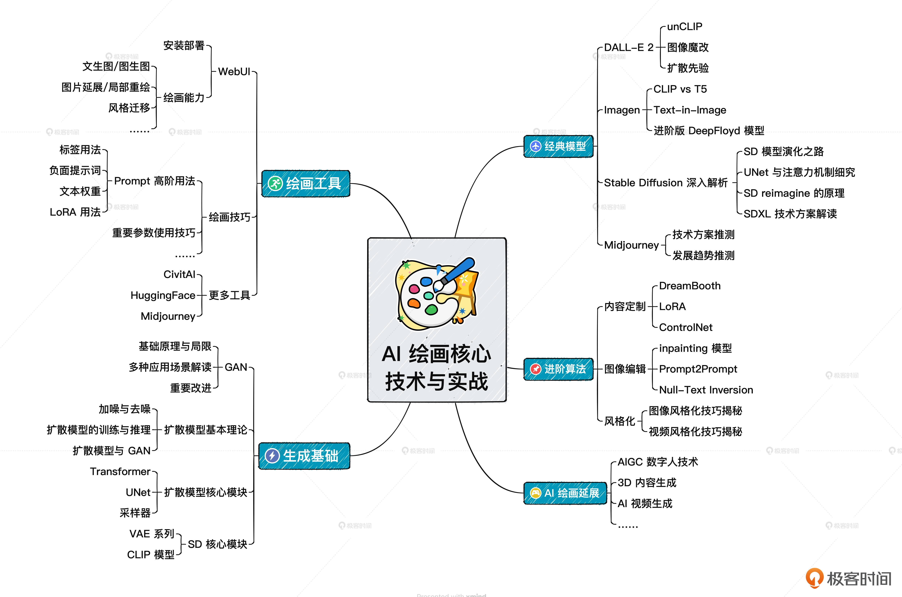

# advice
arxiv 网站上几乎每天都会更新AICG领域内最新论文。
能明显感觉到，在 AIGC 领域内，几乎每天都有新论文、新方案被提出。
给人的感觉是稍不留神就会掉队，但是真正一头扎进去，又会发现新论文、新技术根本学不完。

面对这个问题，建议是：
不必追求大而全，跟紧自己最感兴趣的那一部分就够了，其余方向定期关注技术资讯就好。
比如，我们的主线是以 SD 模型 AI 绘画技术，对于文生 3D、文生数字人我们只需要关注最里程碑式的工作即可。

多模态生成与多模态理解在未来会有大一统的方案，倾向于是 GPT 统一掉 AI 绘画。这件事情的标志是什么呢？
我觉得应该是出现这样一个模型，它的输入是文字和图片，输出是离散化的 token。
而这些 token 可以重建为文字或者高质量的图像。如果这一天真的到来，属于扩散模型的时代也许就要过去了。

掌握了 AI 绘画的基础知识和经典解决方案，再去看其他非扩散模型的 AI 绘画方案，我们也会发现很多底层知识是相通的，
对于Stable Diffusion的学习不会白学。

## summary

