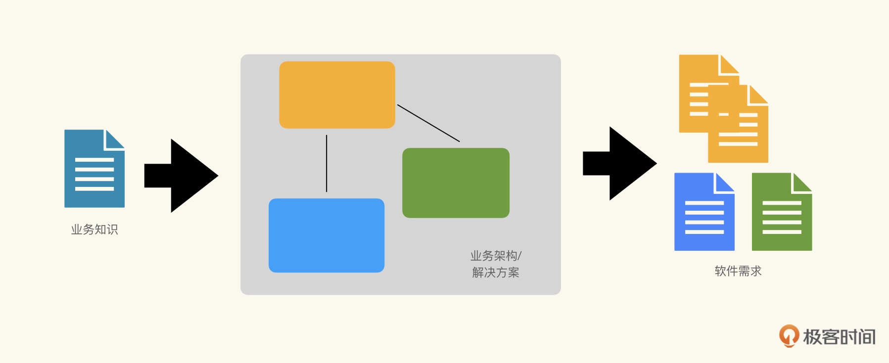
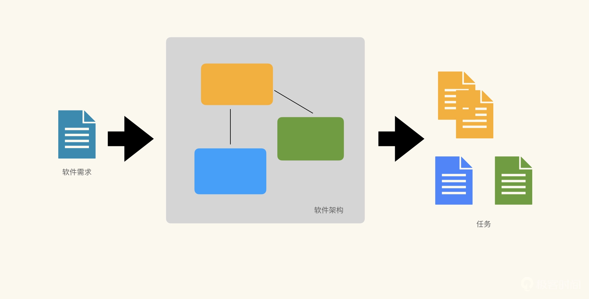

# 通过知识过程重新理解软件工程
软件中包含的知识软件本身是载体，并不是真正的产品，真正的产品是包含在其中的知识。

对于作家而言，内容才是真正的产品，书籍只是内容的载体。
对于软件，<strong>真正的产品是软件中所包含的知识，软件自身仅仅是知识的载体</strong>。

软件中还会承载其他的知识，比如软件的运营知识等等，但是从构造软件的角度上讲，<strong>最重要的两类知识就是业务知识和架构知识</strong>。
一个是关于什么是“正确的软件”的知识，另一个则是关于“如何正确地构造软件”的知识。

## 业务知识
软件中包含的最重要的知识就是业务知识，也就是我们所说的业务流程、组织架构、行业规则、领域知识等等。
这些知识描述了软件是如何帮助客户解决某一类问题，或是一家企业是如何运营其业务的，或是以何种形式与用户互动等等。

## 架构知识
除去业务知识之外，软件中还包含关于<strong>“软件系统该如何实现”</strong>的知识，也就是我们所说的软件架构。
架构定义了系统中组件的类型以及组件间交互的方式。

架构有两个目的：帮助我们理解系统现状，以及当有新需求出现时我们要如何实现它们。

对于理解系统现状而言，架构知识是显式知识。
对于应对新需求的变化，需要将需求分解到对应的组件中去，并严格依照组件间的交互方式完成业务逻辑。
此时，架构的主要作用是作为系统需求功能拆分的指导，是以不可言说知识的形式在发挥作用。

 

## 将软件研发过程构造为知识过程
进入交付流程之前，我们需要:
- 按照当前对于业务知识的理解，构造一个目标解决方案。这个目标解决方案可以是<strong>业务架构愿景或是选定的解决方案</strong>。
- 然后按照目标解决方案<strong>将业务知识转化为软件需求</strong>，也就是将软件功能分配给不同的业务模块。

这是目标解决方案知识的应用，此时我们处在庞杂模式：感知（对于要解决的问题已有初步理解）- 分析（按照业务架构 / 解决方案处理问题）- 响应（得到不同软件系统的软件需求）。

一旦根据软件需求确立了研发 / 交付计划，进入交付流程之后，对于软件构造全部都会围绕质量展开。

功能性质量由软件需求决定，而非功能性质量（性能、可靠性、安全性、用户体验等）则是由架构知识决定的，
软件架构的设计决策直接影响系统的性能、可扩展性和可靠性。

架构知识发挥作用的方式与目标解决方案类似，也是在任务分解过程中发挥作用，即将软件需求在架构所规定的组件范围内，进一步做任务分解。
此时我们同样处在庞杂模式：感知（对于要解决的问题已有初步理解）- 分析（按照软件架构处理问题）- 响应（得到针对不同架构组件的任务）。

因而架构腐化并不单单指最终的结果，更多是在分解任务的时候，架构不能有效起到指导作用，持续产生不正确的任务划分，架构就会腐化。