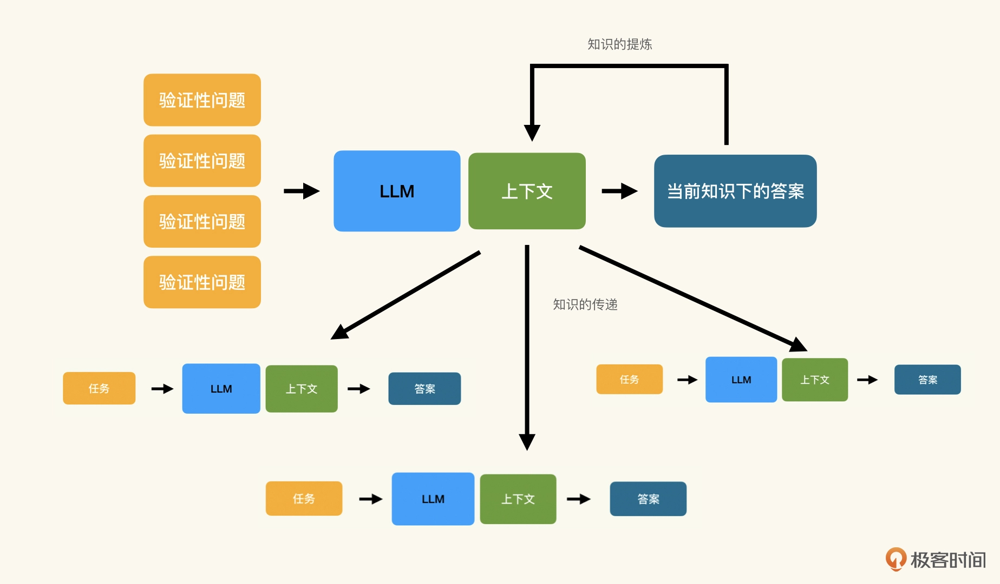

# 使用LLM提取和传递知识

## LLM 是革命性的迁移学习平台
LLM 是怎么帮助我们提取知识的呢？我们首先需要将 LLM 看作一种特殊的迁移学习（Transfer Learning）平台。

迁移学习（Transfer Learning）是机器学习领域的一个重要概念，意思是将从一个问题（源任务）中学到的知识应用到另一个相关的问题（目标任务）上。
即使两个任务不完全相同，一个任务中学到的特征、模式和知识也可以在另一个任务中发挥作用，从而提高学习效率和性能。

比如，一个可以识别猫狗的计算机视觉 AI，可以通过迁移学习训练成用来识别汽车的 AI。


LLM 是一个非常特殊的模型，它的<strong>核心能力是阅读理解——结合预训练集中的语料，根据提示词中提供的上下文信息执行任务</strong>。
从概念上说，当我们为 LLM 提供了上下文之后，实际已经把 LLM 迁移成为一个</strong>面向特定领域的模型</strong>了。


之所以可以将 LLM 看作迁移学习, 是因为 LLM 在大规模数据集上进行预训练，能够学习到语言的深层结构和模式，因此具备了很强的泛化能力。

这意味着 LLM 可以很容易地适应新的任务和领域，即使这些任务和领域在预训练时没有明确地被考虑进去。
伴随着泛化能力，目前很多 LLM 支持零样本（zero-shot）或少样本（few-shot）学习。
这意味着即使没有数据训练，或者只有很少的数据的情况下，LLM 也可以执行特定任务。

零样本或少样本学习是一种革命性的迁移学习机制。比起传统迁移学习，训练数据从几千几万条降低到零或几条。
训练时间从几天、几周甚至几个月缩短到几秒钟或者几分钟。

<br>

## 聚焦于知识而非任务
我们习惯性地认为，将某个工作实际做出来是非常花费时间的，那么越早开始越好。
但是在 LLM 时代，做出来的成本是非常低的，做对的成本是非常高的。
因而，用好 LLM 的第一步，就是<strong>聚焦于知识的提取与组织</strong>。

我们可以把要做的事情放在一边，将目光更多的集中在如何迁移训练 LLM，也就是如何提取上下文、如何提取知识上。那么我们可以构造这样的一个提示词：
```
背景
===
目前我们在编写一个产品目录服务，通过API提供所有可售商品的详细信息。
此API包含列出所有商品，按SKU查看某个商品，按照分类列出商品以及按关键词搜索的功能；
使用Go语言编写。

任务
===
请问这个产品目录服务主要有什么功能？
```
建议所有人在使用提示词的时候，都<strong>将知识的部分（背景）与任务的部分分开</strong>。这样能有一个明确的关注点。

同样，我们还可以继续验证当前的业务知识是否是足够的，比如：
```
背景
===
目前我们在编写一个产品目录服务，通过API提供所有可售商品的详细信息。
此API包含列出所有商品，按SKU查看某个商品，按照分类列出商品以及按关键词搜索的功能；
使用Go语言编写。

任务
===
请问通过API提供的产品信息都包含哪些内容？
```
如果在这个基础上去生产代码，会有很多无用的功能。
因为我们这里是个例子，并没有细扣其中的具体实现细节，但是在实际工作中，我们可能会根据实际的情况，补充更完备的信息，比如：
```
背景
===
目前我们在编写一个产品目录服务，通过API提供所有可售商品的详细信息。
商品详细信息包括：SKU，商品名字，不同的产品选项，以Markdown形式保存的商品详情；
此API包含列出所有商品，按SKU查看某个商品，按照分类列出商品以及按关键词搜索的功能；
使用Go语言编写。

任务
===
请问通过API提供的产品信息都包含哪些内容？
```
当我们把目标聚焦于知识时，我们所关注的就不再仅仅是通过 LLM 帮助完成某些功能，而是如何使用 LLM 高质量地完成某些功能。

<br>

## 通过 LLM 提取与传递知识
通过 LLM 的反馈反思并修改知识描述的方式，就是知识工程中的知识提取流程:



当我们完成了知识提取，再将知识应用到具体的任务时，就是知识的传递和应用的过程。

刚刚的例子，我们提取的是什么知识呢？我们提取的是隐式知识（Implicit Knowledge）。
因为对于业务的上下文我们已经有了构想和要求，只不过没有变成文字形式而已。

在提取了隐式知识之后，我们就可以在提取的知识之上，完成不同的任务了。
这时候我们的关注点又从知识重新回到了任务。
但此时我们会发现，提取出的知识并不仅仅能服务于某一项任务。

在上面的例子里，虽然我们是为了编写代码而做的知识提取，但是产生的结果可以服务于其他任务。比如，为 API 编写文档：
```
背景
===
目前我们在编写一个产品目录服务，通过API提供所有可售商品的详细信息。
商品详细信息包括：SKU，商品名字，不同的产品选项，以Markdown形式保存的商品详情；
此API包含列出所有商品，按SKU查看某个商品，按照分类列出商品以及按关键词搜索的功能；
使用Go语言编写。

要求
===
所有API文档需要以RAML形式编写;
如存在异常分支，给出示例;

任务
===
根据背景中描述的业务，按要求编写文档
```