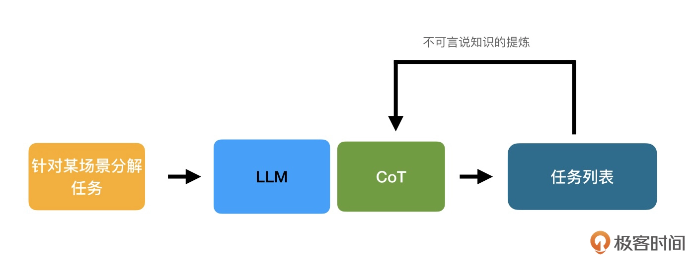

# 使用LLM应用和提取不可言说知识

## 与 LLM 交互的模式
由于 LLM 的回答具有不确定性，我们与 LLM 的默认交互模式是复杂认知模式，它的表现是：
- 探测（Probe）：我们向 LLM 提出问题或者任务，LLM 帮助我们执行这个任务，并产生了初始结果；
- 感知（Sense）：我们依照 LLM 返回的结果，思考哪些地方是我们不满意的，或者需要进一步了解的。然后我们提出新的问题，或者是重新调整初始问题；
- 响应（Respond）：通过不同的问题调整，最终拿到满意的结果。

那是不是说 LLM 只能在复杂模式下发挥作用呢？当然不是。这完全取决于我们给予 LLM 的任务是什么，以及要拿到的结果是什么。
比如，我们可以给予 LLM 一个非常明确的任务：
```
在数据库中存在
-表departments，字段为[DepartmentId, DepartmentName], 
-表students，字段为[DepartmentId, StudentId, StudentName]
请为"查找所有计算机学院的学生"生成MySQL的查询语句
```
我们对于要做的修改有清晰的认识，所以我们处在清晰的认知模式中。

当我们讨论 LLM 的交互模式时，需要区分: <strong>哪些是应对 LLM 不确定性的，哪些是我们认知行为的体现</strong>。

<br>

## 清晰模式下的 LLM 交互模式
处在清晰模式时，认知行为表现为：感知（sense）- 归类（categorize）- 响应（Respond）。
- 感知就是对于问题的定义，也就是对于知识的提取
- 归类是对于任务的选择，也就是根据任务选择不同的提示词模版。


ChatGPT 本身是不支持模板的。下面的例子，我们以 LangChain 的提示词模板为例，其他框架也都大同小异。比如，生成 API 的模板就是：
```
需求背景
=======
{requirements}

API要求
=====
API返回的结果是json格式；
当查找的SKU不存在时，返回404；
按关键搜索功能使用POST而不是GET；

任务
===
按照API要求为需求设计RESTful API接口。使用RAML描述。
```

由于处在清晰模式时，对于要处理的问题和解决方案都有明确的认知，
我们与 LLM 交互模式就是: 
<strong>
通过指导性提示词（Instruction Prompting）充分详细地描述要处理任务的上下文和对于任务的要求，让 LLM 负责生成最后的结果
</strong>

<br>

## 庞杂模式下的 LLM 交互模式
处在庞杂模式时，认知行为表现为：感知（sense）- 分析（analysis）- 响应（Respond）

庞杂模式与清晰模式的差别在于: 对于解决方案的寻找，是<strong>直接分类还是通过分析筛选</strong>。

处在庞杂模式下的时候，我们并不知道具体的任务有哪些，分别是什么。

这时候我们可以使用<strong>知识生成（Generated Knowledge）</strong>让 LLM 帮助我们分析要处理的问题。

所谓知识生成，是指先抛开最终的诉求，让 LLM 先生成一些关于最终诉求的知识。这些知识可能以事实信息、规则或是示例的形式出现。

这些<strong>生成的知识随后会在 LLM 执行任务时作为补充输入</strong>提供给 LLM。
比如，我们想让 LLM 去编写代码，那么就可以先让 LLM 根据要解决的问题，生成一个求解思路，然后再要求 LLM 按照这个思路完成编码。

在庞杂模式下，<strong>最有用的知识生成就是生成任务列表</strong>。因为任务列表本来就是分析的结果，是思路的体现。
对于任务列表达成一致，就是思路的对齐。而一旦我们明确了需要 LLM 进行的任务，那么就进入了清晰模式。

任务列表的生成可以通过思维链（Chain of Thought，CoT）的方式来实现。
<strong>CoT 是一种鼓励 LLM 解释其推理过程的方法</strong>。具体做法是向模型陈述推理过程。然后，要求 LLM 也要遵循类似的推理过程。

<br>


## 复杂模式下的 LLM 交互模式
与庞杂模式不同，在处在复杂模式时，我们对于要解决的问题甚至没有完整的思路。
因而，响应并不是这个模式下主要要考虑的问题，<strong>获取思路才是重点</strong>。

如果我们没有思路，就无法通过 CoT 指导 LLM 生成知识。那么也可以通过默认交互模式，围绕解决问题的思路与 LLM 交互。


如果不提供思路给CoT(要求为空，没有填写)：
```
需求背景
=======
{requirements}

API
===
{API}

要求
===

任务
===
现在我们要按照要求，根据需求实现API中提及的RESTful API。
请先生成任务列表。
```
LLM 会给你返回一种思路。

复杂模式下还需要进一步的迭代与反馈，才能达到可用的状态。
这很形象地表现了未被充分学习和已经被充分学习的不可言说知识在 LLM 上的差别，也就是说能够转化为 CoT（或类似技术）的，就是已经被充分学习了的不可言说知识。

因而，不可言说知识的提取就是<strong>提取 CoT 的过程</strong>。




除了通过反馈学习提取不可言说知识之外，发现并学习已经被提取出来的不可言说知识，也是复杂模式下一种重要的行为模式。
目前比较流行的方式是使用检索增强生成（Retrieval Augmented Generated， RAG）。


在 RAG 架构下，我们提出的问题并不会被直接处理，而是根据提问的问题，首先从知识库中检索相关的片段，
再将对应片段综合，生成最终的 prompt，提供给 LLM 进行回答。

它包含根据问题检索、依据结果增强以及增强之后生成三个部分，因此而得名。