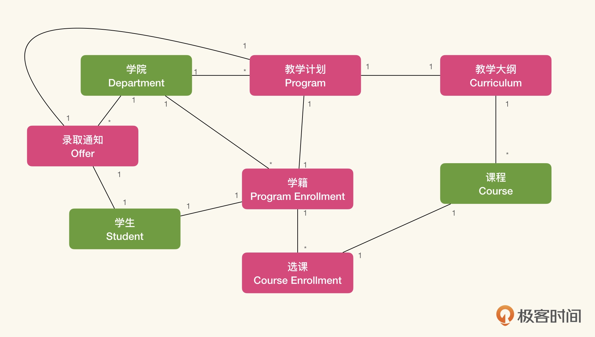
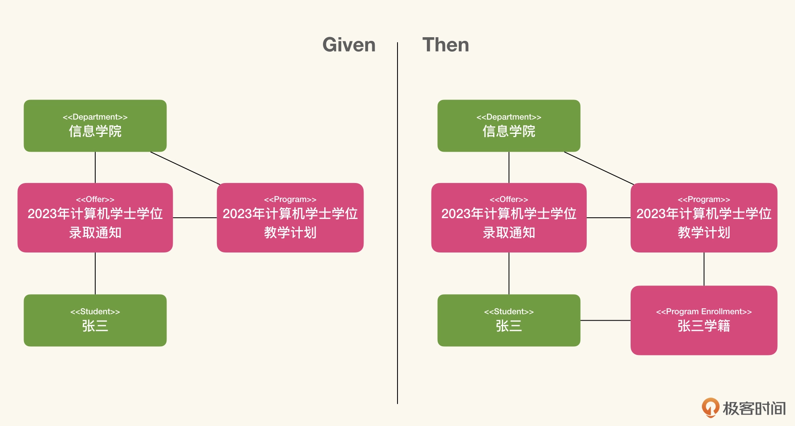

# 通过业务建模应用业务知识
使用大语言模型（Large Langauge Model，LLM）辅助我们的软件研发和交付过程,
就是将软件交付看作知识过程，识别其中的认知行为模式，并选择恰当的 LLM 交互模式，有目的性和针对性地提高整个知识过程的效率。

## 业务模型是如何发挥作用的
软件开发的核心难度在于<strong>处理隐藏在业务知识中的复杂度</strong>，业务模型就是对这种复杂度的简化与精炼。

所谓模型展开，就是在给定的业务上下文中，<strong>将业务模型中的概念实例化</strong>，通过实例化的业务模型，解释业务上发生了什么。

假设有如下业务模型:



模型展开:



“获取了录取通知的学生没有注册学籍时”，这表示存在一个 Offer 对象实例，而没有 Program Enrollment 的实例；
而“这个学生将能成功注册学籍”，则表示我们可以生成 Program Enrollment 的实例，并将这个实例与 Offer 中的教学计划关联.


模型中实际还存在着<strong>时间顺序</strong>。
- 首先是学院。学院是早于教学计划的。没有对应的学院，也就不存在各种学位的教学计划。
- 然后教学计划是早于录取通知书的，如果没有教学计划也不可能发放相应的录取通知书；
- 最后是录取通知书是早于学籍，因为学生是根据录取通知书注册的，如果没有录取通知书，学籍注册也就无法完成。

从知识工程的角度来看，在我们应用模型来理解业务的过程中，我们是处在庞杂的认知行为模式上的。
通过分析，我们将模型中定义的模式（对象类型与关系种类）应用到当前的上下文中。

<br>

## 通过半结构化自然语言表示模型
首先就会碰到一个问题，如何将我们的业务模型表达为大语言模型能够理解的形式。

LLM 不仅仅懂得自然语言，它还懂得各种编程语言或结构化描述语言。我们可以使用 Mermaid 描述我们的领域模型：
```
classDiagram
  Department "1" -- "*" Program 
  Department "1" -- "*" Offer 
  Offer  "1" -- "1" Program
  Program "1" -- "1" Curriculum 
  Curriculum "1" -- "*" Course 
  Student "1" -- "1" ProgramEnrollment
  ProgramEnrollment "1" -- "*" CourseEnrollment
  Student "1" -- "1" Offer
  ProgramEnrollment "1" -- "1" Program
  CourseEnrollment "1" -- "1" Course 
  
  class Department {
  }
  class Program {
  }
  class Curriculum {
  }
  class Course {
  }
  class Student {
  }
  class Offer {
  }
  class ProgramEnrollment {
  }
  class CourseEnrollment {
  }
```
当我们把这段 Mermaid 录入 LLM，它会为我们提供它的理解.
其中大部分的内容都是正确的，只是不够准确。比如领域概念的名字，在 LLM 中的解读部分就是错误的。

这时候可以使用半结构化自然语言。
所谓半结构化自然语言，就是在结构化的描述中<strong>混入自然语言去补充对应的上下文</strong>。说人话就是写注释。

在 Mermaid 中增加注释，并给出解释和例子:
```
classDiagram
  ...
  %% 学院
  class Department {
  }
  %% 教学计划
  %% 比如，计算机科学与技术学士学位教学计划，或是计算机科学与技术硕士学位教学计划
  class Program {
  }
  %% 教学大纲
  class Curriculum {
  }
  %% 教学课程
  class Course {
  }
  %% 学生
  class Student {
  }
  %% 录取通知
  %% 通知学生被那个教学计划录取，比如张三录取为学士学位学生
  class Offer {
  }
  %% 学籍
  %% 根据录取通知将学籍注册到指定的教学计划，比如，张三根据录取通知注册为2023年入学的计算机科学与技术学士学位教学计划学生
  class ProgramEnrollment {
  }
  %% 选课
  %% 在学籍有效期内，需要根据教学大纲选课
  class CourseEnrollment {
  }
```
我们通过注释，实际上使用了少样本迁移学习（Few Shots Example），在一个小范围的上下文中，给 LLM 提供了更为具体的迁移指引。