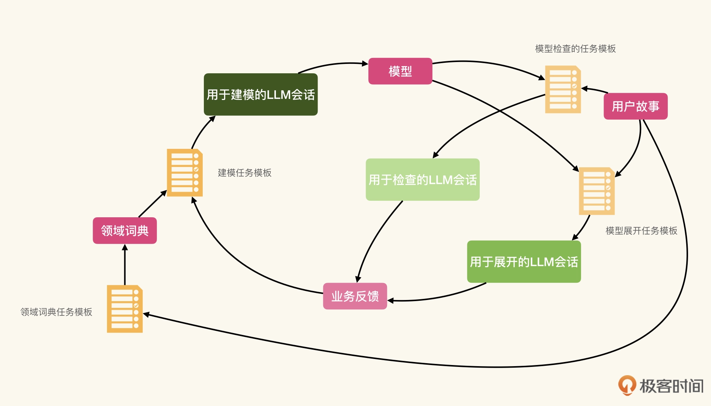

# LLM辅助建模
建模的过程，是学习业务知识并提炼知识的过程。

## 构造反馈循环
我们可以通过构造一个反馈循环，使用 LLM 帮助我们完成建模的过程。

在反馈循环的过程中，我们处在复杂的认知模式下，也就是遵循探测（Probe）- 感知（Sense）- 响应（Respond）的认知行为模式。

模型是对于现实世界的抽象，是没有对错之分的，只有不同的角度和抽象的方式。
我们评价一个模型，首先看能否适用于业务场景，然后是能否应对业务场景的变化。那么我们可以通过模型展开验证模型的适用度，以及应对变化的能力。

在建模的过程中，不可能一次就建模正确。我们很可能碰到概念缺失的情况，也就是在用户故事或其他业务上下文中提及的概念，在模型中不存在。
或是关系错置的情况，也就是模型中对象间的关联关系不正确的情况。因而在展开之前，我们可以先行<strong>反馈</strong>这些问题。
于是，我们最终的反馈循环看起来是这个样子的：



这也是知识工程的一个基本模式：<strong>构造复杂认知模式的反馈循环，并通过 LLM 加速</strong>

我们需要三个任务模板，一个负责建模，一个负责模型的展开，一个负责模型检查。


1. 建任务模版：
```
业务描述
=======
{context}

任务
====
根据业务描述，为系统建立模型。可以添加你认为必要的实体和关系。并将模型表示为mermaid的class diagram
```


2. 模型检查模版：
```plain
领域模型
======
mermaid
{model}

用户故事
======
{user_story}

验收场景
======
{ac}

任务
===
针对这个用户故事和验收场景，领域模型中缺少哪些概念？或者存在哪些不正确的关联关系。
请用文字表示缺失的概念是什么？以及存在哪些不正确的关联。
```

3. 模型展开任务模板：
```plain
领域模型
======
mermaid
{model}


用户故事
======
{user_story}

验收场景
======
{ac}

任务
===
数据都以yaml格式给出。
首先，请根据领域模型理解用户故事中的场景，并针对验收场景中Given的部分，给出样例数据。
然后，参看验收场景中When的部分，给出样例数据会产生怎样的改变。
```

在模型展开的模板中，我们需要用户故事和验收场景，例如：
```
user_story：作为学校的教职员工（As a faculty），我希望学生可以根据录取通知将学籍注册到教学计划上（I want the student to be able to enroll in an academic program with given offer），
从而我可以跟踪他们的获取学位的进度（So that I can track their progress）

ac：如果获取了录取通知的学生没有注册学籍时（<strong>Given</strong> student with offer hasn’t enrolled any program），
当这个学生注册时（<strong>When</strong> the student enroll），那么这个学生将能成功注册学籍到录取通知指定的教学计划中（Then the student will successfully enroll the program specified in the offer）
```


tips: 使用 ChatGPT-4 的插件，可以直接显示模型图。如果没有插件的话，可以根据 ChatGPT 生成的 Mermaid 在使用在线编辑器看图。


<b>

## 通过概念字典辅助建模
通常在建模的过程中，我们会维护一个概念字典（Glossary），其中包含对于系统非常重要的业务概念，以及对于这些概念的基本解释。

比如：
```
这是一个教学学籍管理系统。系统中应该包含以下的核心概念：
- 教学计划：一系列相关课程和活动，这些课程和活动旨在培养特定领域的知识和技能。比如，计算机科学与技术学士学位教学计划，或是计算机科学与技术硕士学位教学计划
- 录取通知：学生需要根据录取通知注册学籍。录取通知应该包含学生被录取的信息，如录取的教学计划
- 学籍：当学生注册之后，学籍记录学生在校将按照哪个教学计划学习
- 学生
```
概念字典的构建并不需要完全依靠 LLM 的反馈。在建模的过程中，我们通过对领域或业务的理解、用户访谈，甚至是阅读用户故事，都不难发现其中涉及的一些概念，以及这些概念之间的关联。

这样，建模的模版可以升级为：
```
业务描述
=======
{context}

系统中涉及概念的glossary如下：
{glossary}

任务
====
根据业务描述，为系统建立模型。可以添加你认为必要的实体和关系。并将模型表示为mermaid的class diagram
```

也可以使用 LLM 辅助我们提取这个概念字典。我们可以设计这样的任务模板：
```
用户故事
======
{story}

任务
===
请根据用户故事中描述的业务场景，提取其中的业务概念，并给出每个概念的定义。
结果以表格形式给出。
```

在最开始的时候，我们完全使用复杂认知模式（Complex），依靠反馈循环辅助我们完成建模的过程。
而当我们发现 LLM 给出的反馈，可以构成概念字典时。
我们的关注点，就变成了如何有效地生成概念字典。也就是，我们从探测性的模型生成转向了有针对性的知识生成（Generated Knowledge）。
这实际是一种认知提升的体现，我们也由此逐渐进入到庞杂认知模式（Complicated）。


## 围绕概念字典构造思维链
一旦进入到庞杂认知模式，那么通过构造思维链（Chain of Thought）提高效率就是一个很自然的选择了。