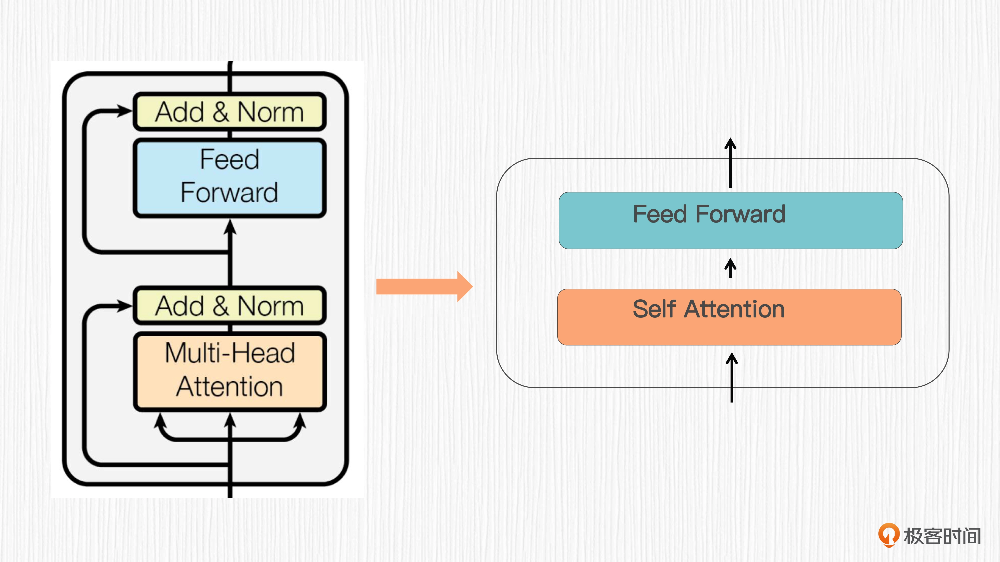
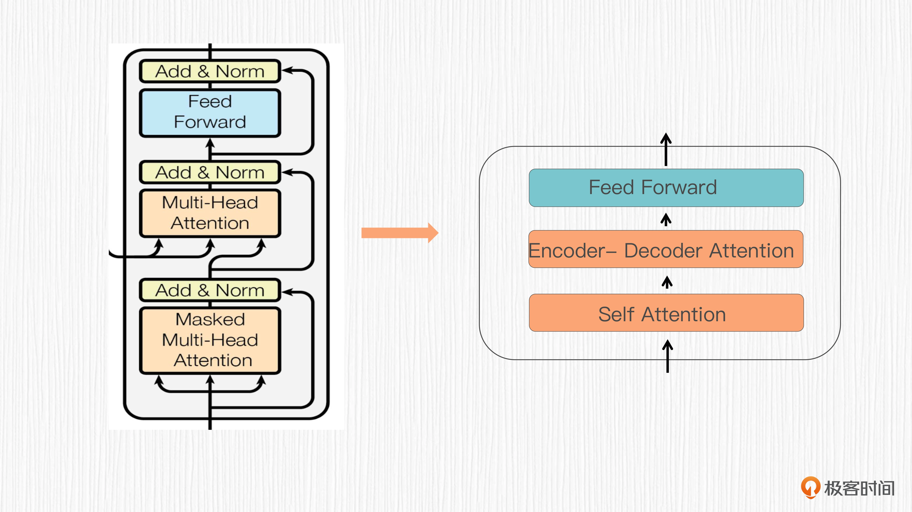
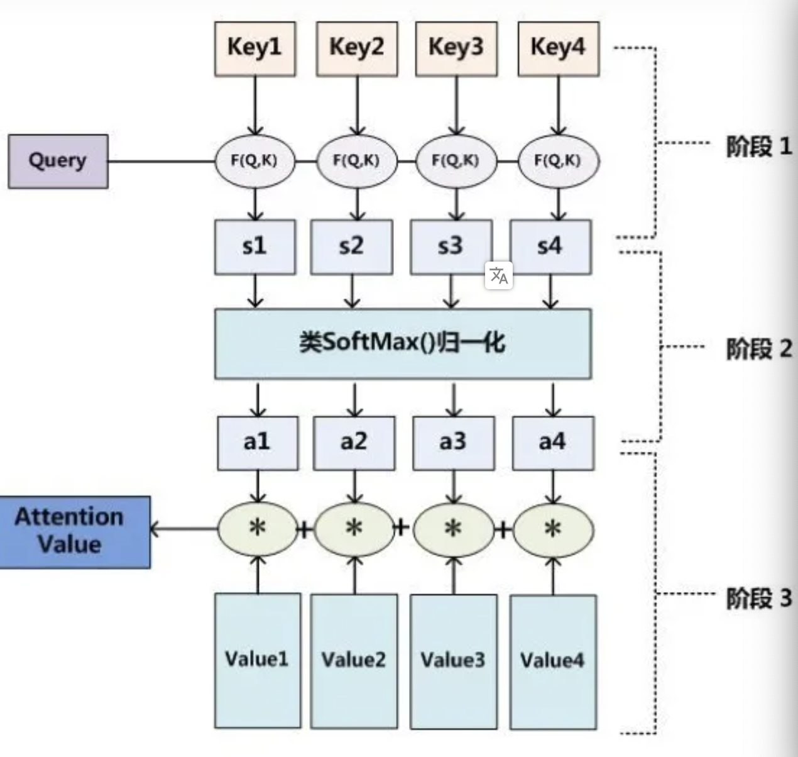
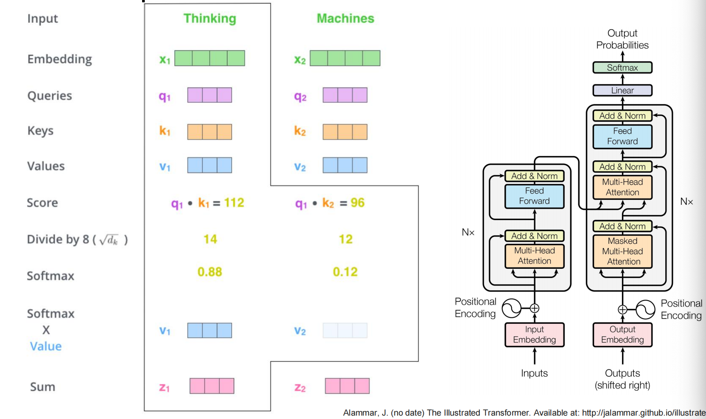
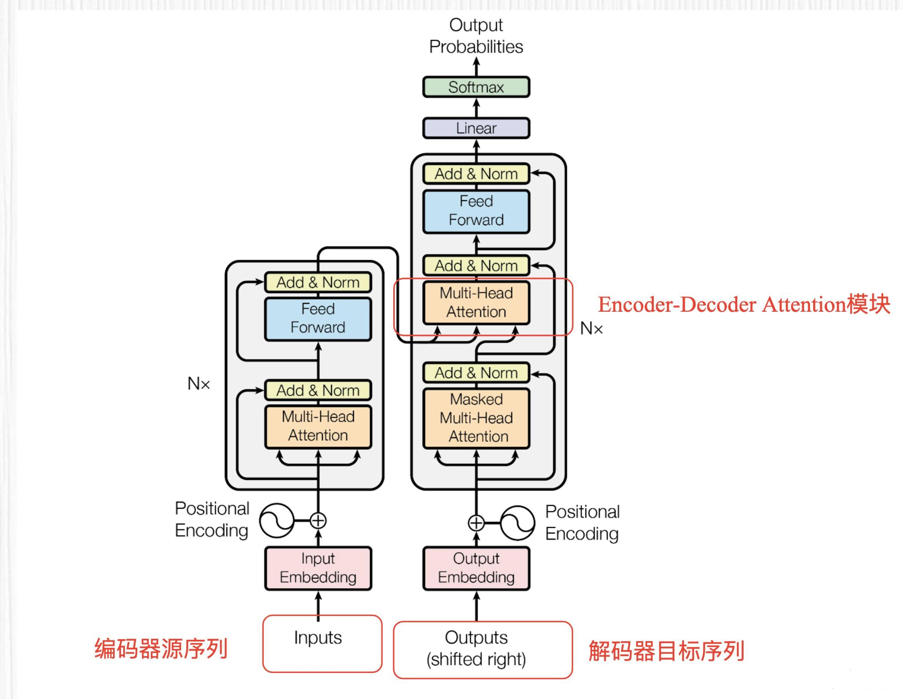

# attention
注意力机制，实际就是将有限的注意力集中在重点信息上，从而节省资源，快速获得最有效的信息。

图书管（source）里有很多书（value），为了方便查找，我们给书做了编号（key）。当我们想要了解漫威（query）的时候，我们就可以看看那些动漫、电影、甚至二战（美国队长）相关的书籍。
为了提高效率，并不是所有的书都会仔细看，针对漫威来说，动漫，电影相关的会看的仔细一些（权重高），但是二战的就只需要简单扫一下即可（权重低）。
当我们全部看完后就对漫威有一个全面的了解了。

注意力模块通常作为一个子结构嵌入到更大的模型中，作用是提供全局上下文信息的感知能力。

下面的两张图是对 Transformer 中一层的编码器和解码器结构的简化。可以看出，这里用到的便是自注意力模块和m交叉注意力模块：





如下是Attention原理的示意图：



Attention 原理的3步分解：
- 第一步：query 和 key 进行相似度计算，得到权值
- 第二步：将权值进行归一化，得到直接可用的权重
- 第三步：将权重和 value 进行加权求和
  
```
从上面的建模，我们可以大致感受到 Attention 的思路简单，四个字“带权求和”就可以高度概括，大道至简。做个不太恰当的类比，人类学习一门新语言基本经历四个阶段：死记硬背（通过阅读背诵学习语法练习语感）->提纲挈领（简单对话靠听懂句子中的关键词汇准确理解核心意思）->融会贯通（复杂对话懂得上下文指代、语言背后的联系，具备了举一反三的学习能力）->登峰造极（沉浸地大量练习）。
这也如同attention的发展脉络，RNN 时代是死记硬背的时期，attention 的模型学会了提纲挈领，进化到 transformer，融汇贯通，具备优秀的表达学习能力，再到 GPT、BERT，通过多任务大规模学习积累实战经验，战斗力爆棚。
要回答为什么 attention 这么优秀？是因为它让模型开窍了，懂得了提纲挈领，学会了融会贯通。
——阿里技术
```

<br>

## Self-Attention的计算


自注意力模块(Self-Attention)会计算输入序列中所有元素之间的相似性得分，再通过归一化处理得到注意力权重。<strong>这些权重可以视为输入元素与其他元素之间的联系强度</strong>。注意力模块通过对权重与输入元素做加权求和来生成输出，输出的向量维度与输入相同。

我们通过三个可学习的权重矩阵 WQ​、WK​、WV​ 分别将模块输入序列投影成 Q、K、V 三个向量。Q 代表 Query，K 代表 Key，V 代表 Value。然后通过计算 Q、K 之间的关系，获得注意力权重，最后将这些权重与 V 向量相结合，得到输出向量。伪代码：
```
# 从同一个输入序列产生Q、K和V向量。
Q = X * W_Q
K = X * W_K
V = X * W_V

# 计算Q和K向量之间的点积，得到注意力分数。
Scaled_Dot_Product = (Q * K^T) / sqrt(d_k)

# 应用Softmax函数对注意力分数进行归一化处理，获得注意力权重。
Attention_Weights = Softmax(Scaled_Dot_Product)

# 将注意力权重与V向量相乘，得到输出向量。
Output = Attention_Weights * V
```
有三个小细节你需要注意一下：
- Q 和 K 的向量维度是相同的，比如都是 d_k，V 和 Q、K 的向量维度可以不同，称之为 d_v。
- 缩放因子 Scale 的计算方式是对 d_k 开根号之后的结果，在 Transformer 论文中，d_k 的取值为 64，因此 Scale 的取值为 8。
- 图中被标记为可选（Opt）的 Mask 模块的作用是屏蔽部分注意力权重，限制模型关注特定范围内的元素。你可别小看这个 Mask 模块，它便是自注意力升级为单向注意力、双向注意力、因果注意力的精髓所在！

矩阵 WQ、WK、WV是学习出来的，所以得到的 Query，Key，Value 向量是比较抽象的。在这里，可以简单理解为矩阵的功能相当于抽取特征。 这里的命名 Query，Key，Value 也非常有意思，大家自己想想每个向量的功能就能对应上了。

举个例子，Self-Attention的细节如下图所示，当单词 Thinking、Machines 进行 Embedding 后，分别与矩阵 WQ、WK、WV相乘。例如 Thinking 单词 Embedding 后变成 X1向量，此向量与 WQ相乘后为q1向量，也称为 Queries。X1与 WK 相乘得到 k1 向量，以此类推。



经过一系列运算，最后z1 = v1 + v2, 于是 z1 便包含了两个单词的信息，只不过 Thinking 单词的信息占的比重更大一些，而 Machines 单词的信息占的比例较小。

**自注意力和交叉注意力的区别**，你只需要记住一句话：自注意力的 Q、K、V 都源自同一个输入序列，而交叉注意力的 K、V 源自源序列，Q 源自目标序列，其余计算过程完全相同。对于 Transformer 这类编码器 - 解码器结构来说，源序列从编码器输出，目标序列从解码器输出。

<br>

## Multi-headed attention
多头Attention（multi-head attention），这是Attention is All You Need中提到的multi-head attention，用到了多个query对一段原文进行了多次attention，每个query都关注到原文的不同部分(相关性可能不止一种)，相当于从不同的相关性进行多次单层attention, 得到多个attention score。

多头注意力机制有什么好处呢？我用一个简单的类比来给你解释。假设一个团队有 N 个成员，每个成员专注于解决输入序列中不同类型的问题（例如不同领域的语义关系），然后将每个成员的结果结合起来，从而组合不同领域的知识。

刚刚的例子，我们有三个矩阵 WQ、WK、WV 与单词的 embedding 相乘，如果不仅仅是这三个矩阵呢 ？ 
比如 WQ1、WK1、WV1，WQ2、WK2、WV2等等，这样就不仅仅得到一个Z, 还会有 Z1,Z2等等。


multi-headed attention 能够使得信息更加丰富。
比如，如果不是多头的注意力机制，it 和 the animal 是相关度最高的，这符合我们的预期。
但根据句子中 it was too tired 可知，it 除了指代 the animal 还是 tired 的。
如果再引入一个 attention layer，这个 layer 就可能捕获 it 与 tired 的相关度。

multi-headed attention 全流程如下：


<br>

## Encoder-Decoder Attention 模块
编码器 - 解码器注意力（Encoder-Decoder Attention）模块是解码器中的一个关键子模块，实际上它是一个交叉注意力模块，点开下面的图你一眼便会发现这个模块的 Q、K、V 源自不同序列。



编码器的输入可以是我们要翻译的文本、或者是我们问 ChatGPT 的问题，那么解码器的目标序列又要如何获得的呢？

在训练阶段，目标序列通常是**从训练数据获取**的。例如，在机器翻译任务中，训练数据包含源语言序列及其对应的目标语言序列。在训练过程中，目标序列会被输入到解码器，解码器同时根据编码器提取的特征表示（Encoder-Decoder Attention）去预测相应的输出序列。通常情况下，目标序列会以一个特殊的开始符号（如 `<start>`）开始，以确保模型在生成序列时从预定义的起点开始。

在机器翻译中，训练数据包括一种语言的句子（源语言）及其另一种语言的翻译（目标语言）。在训练过程中，我们把这些目标句子输入到解码器部分，让 Transformer 学会根据源句子生成正确的翻译。

在训练阶段，解码器输入的目标序列是从实际的训练数据中获得的，而不是解码器在前一步生成的输出。这意味着，即使模型在前一个时间步预测错误，训练阶段的解码器输入仍然会使用正确的目标序列。这种做法有助于训练模型更好地捕捉源序列和目标序列之间的映射关系，加速收敛过程。

在预测或推断阶段，目标序列使用训练时用到的特殊符号作为初始值。随后，解码器会生成目标序列，一次生成一个 token。对于每一步生成的 token，都会将其添加到目标序列中，并将这个扩展后的目标序列作为输入输送到解码器。这个过程会一直持续，直到生成一个特殊的结束符号（如 `<end>`）或达到预定义的最大序列长度。这便是人们常说的**自回归模型**。

编码器 - 解码器注意力模块的计算过程便非常容易理解了。首先基于源序列的特征计算得到 K 和 V 向量，然后从目标序列的表示（比如前一层的输出）中获得 Q 向量。之后的过程就和标准的自注意力一样了。

<br>

## 更多注意力模块
说完了自注意力、交叉注意力、多头注意力，我们再来看看单向注意力、双向注意力和因果注意力，这三种注意力是通过 Mask 操作，也就是屏蔽部分注意力权重实现的。

- 单向注意力机制主要关注给定位置之前或者之后的上下文，从而捕捉输入序列中的单向依赖关系。比如，在看电影时只观察当前时间点之前发生的事件，电影甚至允许倒着放，只要是单向就行。
- 双向注意力机制能够同时关注给定位置之前和之后的上下文，从而捕捉输入序列中的双向依赖关系。不带 Mask 操作的自注意力和交叉注意力都属于双向注意力机制。比如，我们已经看过整个电影，了解了所有事件情节。
- 因果注意力机制仅关注给定位置之前的信息，因此在生成过程中通过 Mask 操作避免暴露之后的内容。比如，从头开始写一本小说，只能根据已经写了的情节合理地续写未来情节。

<br>

## 注意力机制的特点和优势
1. 注意力机制有助于克服循环神经网络（RNNs）的一些挑战，例如输
入序列长度增加时性能下降和顺序处理输入导致的计算效率低下。

2. 在自然语言处理（NLP）、计算机视觉（Computer Vision）、跨模
态任务和推荐系统等多个领域中，注意力机制已成为多项任务中的最
先进模型，取得了显著的性能提升。

3. 注意力机制不仅可以提高主要任务的性能，还具有其他优势。它们被
广泛用于提高神经网络的可解释性，帮助解释模型的决策过程，使得
原本被认为是黑盒模型的神经网络变得更易解释。这对于人们对机器
学习模型的公平性、可追溯性和透明度的关注具有重要意义。

<br>

## reference
- https://zhuanlan.zhihu.com/p/91839581