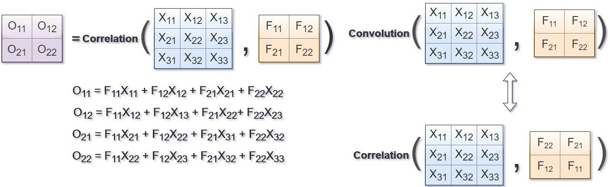
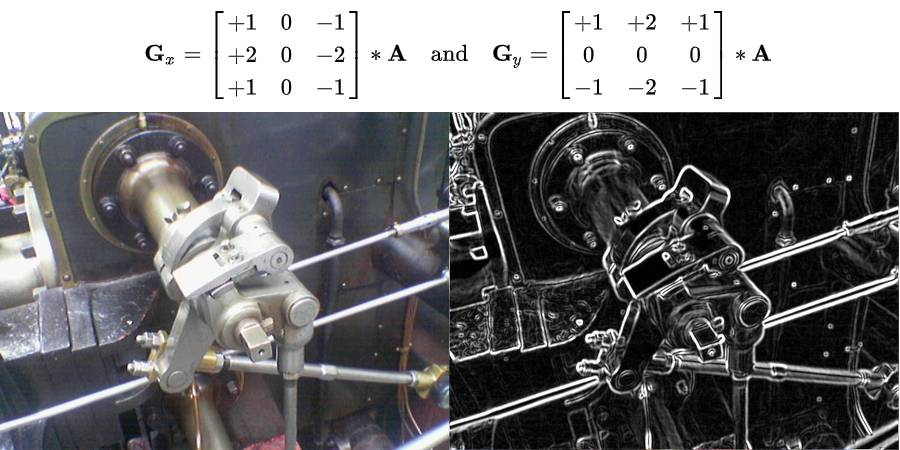
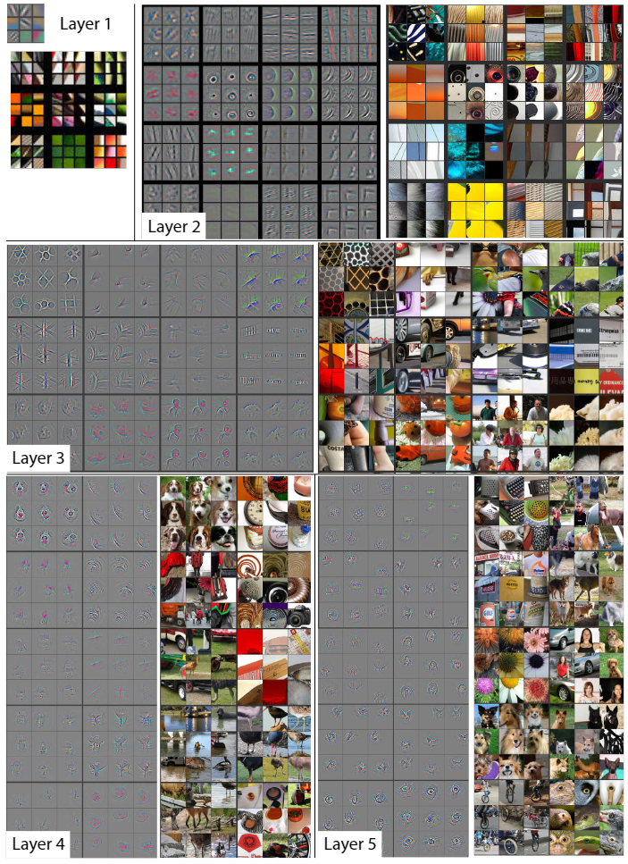

# Convolutional
卷积是一种数学运算，广泛应用于信号处理、图像处理、机器学习等领域，尤其是在深度学习中的卷积神经网络（Convolutional Neural Networks, CNNs）中扮演着核心角色。下面我将从基本概念、数学定义、以及在卷积神经网络中的应用这三个方面来讲解卷积。

## 1. 基本概念

卷积的基本思想是通过一个称为“卷积核”（或滤波器、特征检测器）的小矩阵，在输入数据（如图像）上滑动，对数据进行局部加权求和，并生成一个新的输出矩阵。这个过程可以增强或抑制输入数据中的特定特征，例如边缘、纹理等。

    

<br>

### 数学定义

在离散情况下，二维卷积的一般公式可以表示为：


$$
(C * K)[m, n] = \sum_{i=-\infty}^{\infty} \sum_{j=-\infty}^{\infty} C[i, j] \cdot K[m-i, n-j]
$$


这里：
- \(C\) 是输入矩阵（例如，图像的像素矩阵）。
- \(K\) 是卷积核（权重矩阵），尺寸通常远小于输入矩阵。
- \(C * K\) 表示卷积操作后的输出矩阵。
- \(m, n\) 是输出矩阵的位置索引。
- 求和范围内的 \(i, j\) 需要确保 \(C[i, j]\) 和 \(K[m-i, n-j]\) 的索引合法，实践中常常会对 \(C\) 和 \(K\) 进行边缘填充（padding）以处理边界问题。

#### 示例图


另一个视角：



## 2. 在卷积神经网络中的应用

在卷积神经网络中，卷积层执行的卷积操作具有以下特点：
1. **局部连接**：每个神经元仅与输入数据的一个局部区域相连，这反映了自然图像中的局部特征。
2. **权重共享**：同一层内所有神经元使用相同的卷积核，减少了参数数量，提高了模型的泛化能力。
3. **多通道输入**：对于彩色图像，每个颜色通道（R、G、B）独立进行卷积后，结果被合并，形成新的特征图。
4. **池化（Pooling）**：通常紧随卷积层之后，用于降维，提取更鲁棒的特征。

通过这些机制，CNN能够高效地学习和识别图像中的复杂特征，从而在图像分类、物体识别、图像生成等多种任务中表现出色。

在卷积神经网络（CNN）中，卷积操作的三个关键参数是步长（Stride）、填充（Padding）和通道（Channels），它们对卷积层的输出形状和特征提取能力有直接影响：

### 步长（Stride）

步长定义了卷积核在输入数据上滑动的间隔。如果步长为1，卷积核会逐像素移动；如果步长大于1，卷积核跳跃式移动，这样可以减少计算量并减小输出特征图的尺寸。较大的步长可以使得特征图尺寸减小，有助于减少计算资源的需求，但也可能导致信息丢失。步长的设置是平衡计算效率和保持特征细节之间的一种权衡。

### 填充（Padding）

填充是指在输入数据的边缘添加额外的像素层，以保持输出特征图的尺寸或控制其缩小的程度。常见的填充方式包括：

- **Valid Padding**：不使用填充，输出尺寸通常会小于输入尺寸。
- **Same Padding**：选择合适的填充数量，使得输出尺寸与输入尺寸相同（在不考虑卷积核跨越边缘的情况下）。
- **Extra Padding**：添加更多的填充，使得输出尺寸大于输入尺寸。

填充可以有效地保留输入数据的边界信息，防止边缘信息的丢失，并允许特征检测不受边缘效应的影响。

### 通道（Channels）

通道通常指的是输入数据或卷积核的深度维度。在图像处理中，RGB图像有3个通道，分别对应红、绿、蓝三种颜色信息。卷积核的通道数必须与输入数据的通道数匹配，这意味着每个颜色通道都会有一个对应的卷积核部分来进行卷积运算。在多层卷积神经网络中，随着深度增加，后续层的输入通道数可能不再是3，而是由前一层的输出通道数决定。通道数的增加可以提高网络的表达能力，使其能够学习到更复杂的特征。


下图是一个3*3卷积核，填充为1，步长为1的卷积示意图：


## 3. 理解卷积的意义
这里提供两个理解卷积的角度：

**(1)从函数（或者说映射、变换）的角度理解**。 卷积过程是在图像每个位置进行线性变换映射成新值的过程，将卷积核看成权重，若拉成向量记为w，图像对应位置的像素拉成向量记为x，则该位置卷积结果为:
```
y = w' * x + b
```
即向量内积+偏置，将 x 变换为 y。从这个角度看，多层卷积是在进行逐层映射，整体构成一个复杂函数，训练过程是在学习每个局部映射所需的权重，训练过程可以看成是函数拟合的过程。

**(2)从模版匹配的角度理解**。 前面我们已经知道，卷积与相关在计算上可以等价，相关运算常用模板匹配，即认为卷积核定义了某种模式，卷积（相关）运算是在计算每个位置与该模式的相似程度，或者说每个位置具有该模式的分量有多少，当前位置与该模式越像，响应越强。下图为图像层面的模板匹配，右图为响应图，可见狗头位置的响应最大。当然，也可以在特征层面进行模版匹配，卷积神经网络中的隐藏层即可以看成是在特征层面进行模板匹配。这时，响应图中每个元素代表的是当前位置与该模式的相似程度，单看响应图其实看不出什么，可以想像每个位置都有个“狗头”，越亮的地方越像“狗头”，若给定模板甚至可以通过反卷积的方式将图像复原出来。这里多说一句，我们真的是想把图像复原出来吗，我们希望的是在图像中找到需要的模式，若是通过一个非线性函数，将响应图中完全不像“狗头”的地方清零，而将像“狗头”的地方保留，然后再将图像复原，发现复原图中只有一个“狗头”，这是不是更美好——因为我们明确了图像中的模式，而减少了其他信息的干扰！


### 卷积能抽取特征
以下图sobel算子为例，对图像进行卷积，获得图像的边缘响应图，当我们看到响应图时，要知道图中每个位置的响应代表着这个位置在原图中有个形似sobel算子的边缘，信息被压缩了，响应图里的一个数值其实代表了这个位置有个相应强度的sobel边缘模式，我们通过卷积抽取到了特征。



人工能定义边缘这样的简单卷积核来描述简单模式，但是更复杂的模式怎么办，像人脸、猫、狗等等，尽管每个狗长得都不一样，但是我们即使从未见过某种狗，当看到了也会知道那是狗，所以对于狗这个群体一定是存在着某种共有的模式，让我们人能够辨认出来，但问题是这种模式如何定义？

通过多层卷积，来将简单模式组合成复杂模式，通过这种灵活的组合来保证具有足够的表达能力和泛化能力。

### 多层卷积能抽取复杂特征
为了直观，我们先上图，图片出自论文[《Visualizing and Understanding Convolutional Networks》](https://arxiv.org/abs/1311.2901)，作者可视化了卷积神经网络每层学到的特征，当输入给定图片时，每层学到的特征如下图所示，注意，我们上面提到过每层得到的特征图直接观察是看不出什么的，因为其中每个位置都代表了某种模式，需要在这个位置将模式复现出来才能形成人能够理解的图像，作者在文中将这个复现过程称之为deconvolution.



从图中可知，浅层layer学到的特征为简单的边缘、角点、纹理、几何形状、表面等，到深层layer学到的特征则更为复杂抽象，为狗、人脸、键盘等等，有几点需要注意：

卷积神经网络每层的卷积核权重是由数据驱动学习得来，不是人工设计的，人工只能胜任简单卷积核的设计，像边缘，但在边缘响应图之上设计出能描述复杂模式的卷积核则十分困难。

数据驱动卷积神经网络逐层学到由简单到复杂的特征（模式），复杂模式是由简单模式组合而成，比如Layer4的狗脸是由Layer3的几何图形组合而成，Layer3的几何图形是由Layer2的纹理组合而成，Layer2的纹理是由Layer1的边缘组合而成，从特征图上看的话，Layer4特征图上一个点代表Layer3某种几何图形或表面的组合，Layer3特征图上一个点代表Layer2某种纹理的组合，Layer2特征图上一个点代表Layer1某种边缘的组合。

这种组合是一种相对灵活的方式在进行，不同的边缘→不同纹理→不同几何图形和表面→不同的狗脸、不同的物体……，前面层模式的组合可以多种多样，使后面层可以描述的模式也可以多种多样，所以具有很强的表达能力，不是“死板”的模板，而是“灵活”的模板，泛化能力更强。

卷积神经网络真正使用时，还需要配合池化、激活函数等，以获得更强的表达能力，但模式蕴含在卷积核中，如果没有非线性激活函数，网络仍能学到模式，但表达能力会下降，由论文《Systematic evaluation of CNN advances on the ImageNet》，在ImageNet上，使用调整后的caffenet，不使用非线性激活函数相比使用ReLU的性能会下降约8个百分点，如下图所示。通过池化和激活函数的配合，可以看到复现出的每层学到的特征是非常单纯的，狗、人、物体是清晰的，少有其他其他元素的干扰，可见网络学到了待检测对象区别于其他对象的模式。


总结一下，卷积在卷积神经网络（CNN）中用于提取特征的概念，可以通过以下几个方面来理解：

### 1. **滤波器（卷积核）设计**

卷积核，也称为滤波器或权重矩阵，是一个小型的矩阵，其大小通常小于输入数据（如图像）的尺寸。这个矩阵中的每个元素代表了对应位置上的权重，这些权重是通过训练过程中优化算法学习得到的。不同的滤波器会学习捕捉不同的特征：

- 边缘检测滤波器可能会强调像素间强度的急剧变化，从而识别出图像中的边缘。
- 纹理检测滤波器可能对某些特定模式的像素排列敏感，用于识别纹理特征。
- 更复杂的滤波器可以组合这些基本特征，识别更高级别的特征，如角、圆形或其他几何形状。

### 2. **卷积操作**

卷积过程涉及将滤波器在输入数据（如图像）上滑动，并执行元素级别的乘法和求和操作。这个过程可以看作是滤波器“询问”图像特定区域是否匹配它所代表的特征。当滤波器在图像上滑动时，每次停留都会产生一个输出值，这个值反映了该位置上特征的存在程度或强度。所有这些输出值组成一个新的二维数组，即特征图（Feature Map）。

### 3. **多通道和深度**

在处理彩色图像时，输入数据通常有多个通道（如RGB），滤波器也会相应地设计为三维结构，以适应这些通道。每个滤波器在不同通道上的卷积操作后，其结果会被整合起来形成特征图的一个元素，这样就不仅提取了空间特征，还考虑了颜色信息。随着网络深入，特征图的数量（即网络的深度）也会增加，意味着网络能学习并区分更多种类和更抽象的特征。

### 4. **特征学习的层次性**

在CNN的前几层，滤波器往往学习简单的、基础的特征，如线条、边缘。随着网络层级的深入，滤波器开始学习更复杂的特征，比如图案、形状、甚至是特定对象的部分。这种层次化的特征学习机制，使得CNN能够从原始像素数据中逐步提炼出高级别的抽象概念，对于图像分类、物体识别等任务至关重要。

总之，卷积通过精心设计和学习的滤波器，在数据中寻找和强调特定类型的特征，通过多个层级的处理，从简单到复杂，逐级构建对输入数据的理解，从而实现高效的特征提取。